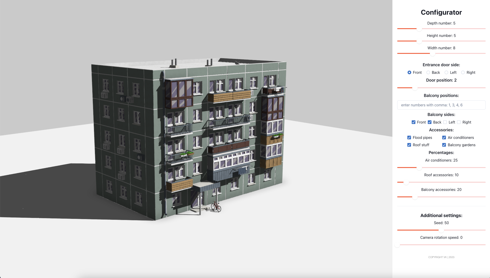

# Web Building Configurator

`PANELKA`

#### The app link: [Configurator](https://vladimirkobranov.github.io/building_configurator_web/)

version 0.9

## Info

Web building configurator made with `React`,`Threejs`,`Fiber`,`Drei`.

**List of possibilities:**

- Length, width, height
- Entrance door position and location
- Balcony sides and locations
- Accessories with random percentage
- Global seed
- Camera rotation value

---

pic 1

### References

- Art style and idea: [Nastya Zhenunk](https://www.artstation.com/artwork/m8ZPZv)
